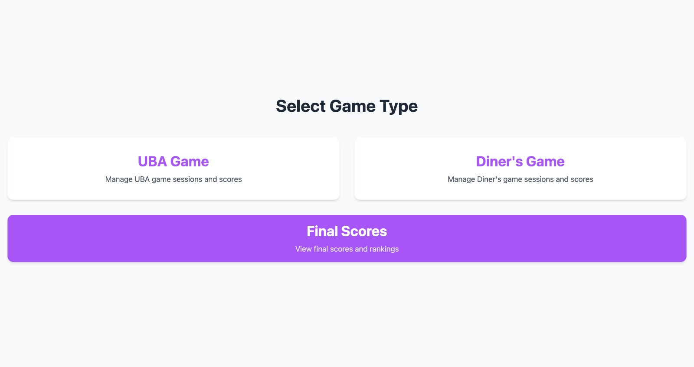
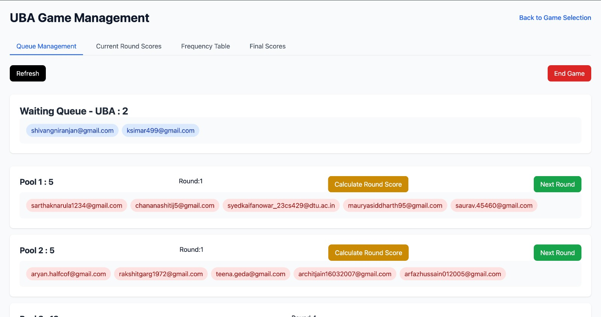
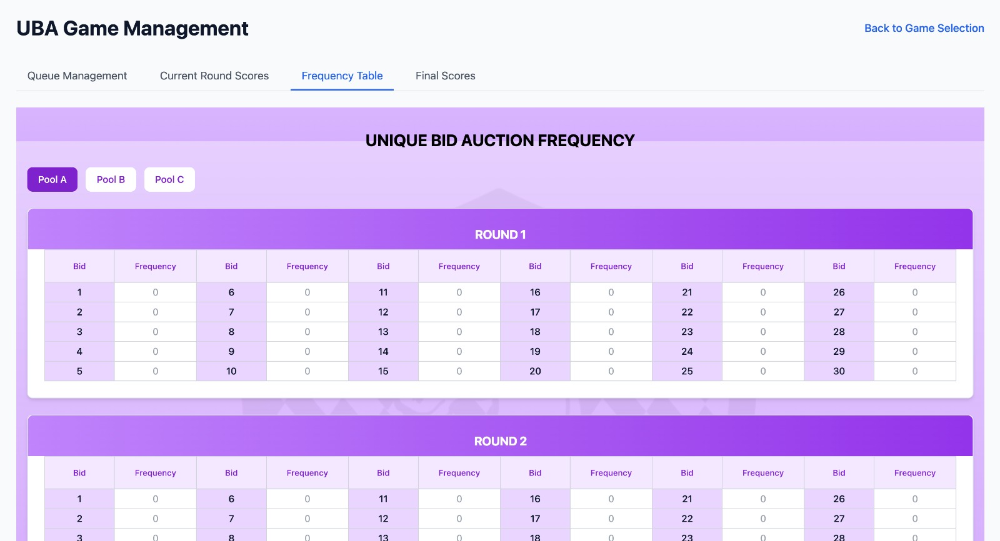
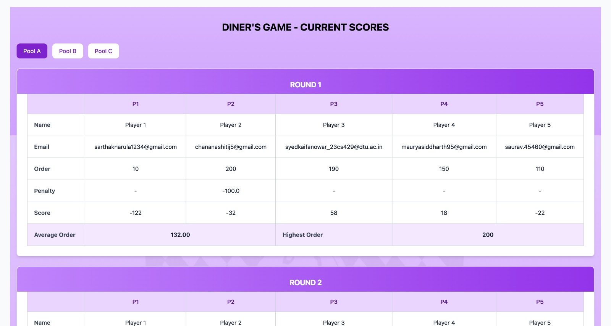
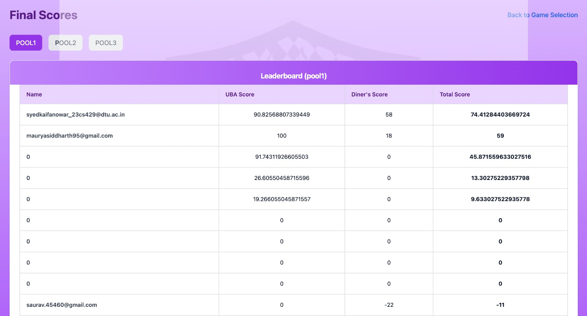

🧑‍💻 Admin View

📄 Overview

This repository contains the Admin View dashboard created for a Game Theory-based event conducted at Delhi Technological University.

The event involved two game platforms: Diners and Unique Bid Auction (UBA), where students participated simultaneously.

The Admin View was used to monitor live data, manage game states, analyze student responses in real time, and show results.

💡 Why wasn't it hosted publicly?

The Admin View was not hosted for security reasons, since it contained sensitive controls and analytics that could affect the event integrity.

For simplicity and security, we hosted this locally during the event and took inputs from the Diners and UBA sites that were publicly hosted for students to use.

🖥️ How to run this project

⚙️ Prerequisites

Node.js and npm installed

Firebase project set up (Firestore & Authentication)

📥 Clone all required repos

To run this game fully, you need to clone all three repositories:

Diners App (frontend for participants)

UBA App (frontend for participants)

Admin View (this repo)

🔗 Connect to Firebase

All three apps must be connected to the same Firebase project.

Create a Firebase project and configure Firestore.

Copy your Firebase config keys.

Add the Firebase configuration to each repo (usually in a .env file or Firebase config file).

▶️ Run locally

In each repo (including this one):

npm install

npm run dev

Then open your local admin dashboard in the browser to monitor live game data.

📸 Screenshots

### Screenshot 1

### Screenshot 2

### Screenshot 3

### Screenshot 4

### Screenshot 5

💡 Usage & Adaptation

This project was developed specifically for a one-time college event.
If you'd like to explore or adapt it, feel free to clone the repository and rename it as needed.
You’re welcome to reach out if you have any questions!

🏫 Credits

Built for Delhi Technological University, as part of an IGTS-DTU event.
